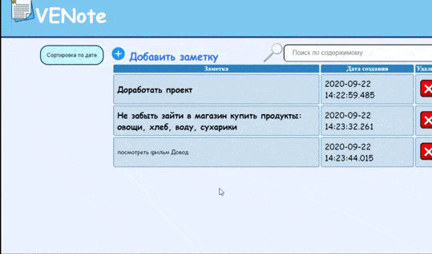

# Note Service
# Overview 

## Let's start
These instructions will get you a copy of the project up and running on your local machine for development and testing purposes.
## Running the application
Before running you should have next software
```
jre8
maven
```
For running app you should clone this reposotiry and after that:
```
mvn package
cd target/
java -jar text-search-engine-0.0.1-SNAPSHOT.jar
```
After that go to <http://localhost:8080/noteList>
